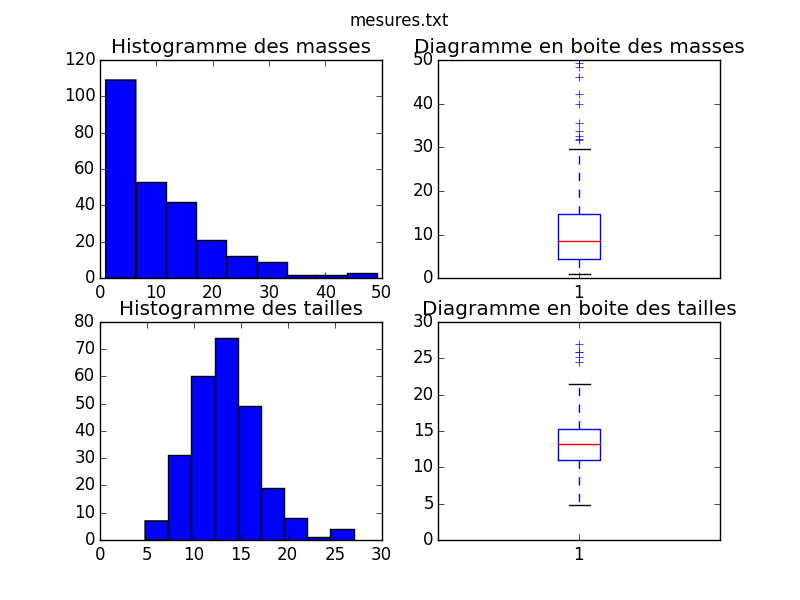
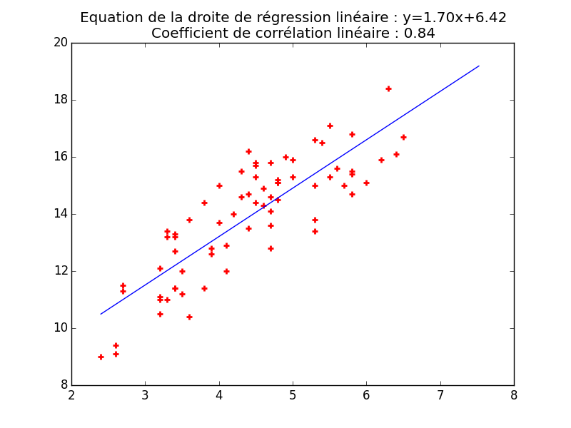

~~~python
~~~

---
title: Corrigé du TP Python sur les Fichiers
author: 852 - M.Lalauze - M.Junier
numbersections: true
fontsize: 12pt
geometry:
- top=20mm
- left=20mm
- right=20mm
- heightrounded  
---

# Exercice 2 : lecture du fichier

~~~python

mes=open('mesuresBCPST.txt','r')
print(mes.readline())

for ligne in mes:
    print(ligne)
mes.close()

~~~

# Création du fichier mesures.txt

~~~python

mes=open('mesuresBCPST.txt','r')
nmes=open('mesures.txt','w')
for ligne in mes:
    liste=ligne.split(' ')
    if len(liste)==4:
        fleur=liste[2]+' '+liste[3]
        listebis=[liste[0],liste[1],fleur]
        newline='\t'.join(listebis)
    else:
        newline='\t'.join(ligne.split(' '))
    nmes.write(newline)
mes.close()
nmes.close()

~~~

# Extraction masse et taille

~~~python

def lecture(fichier):
    f=open(fichier,'r')
    f.readline() # on saute la première ligne
    masse=[]
    taille=[]
    for ligne in f:
        liste=ligne.split('\t')
        masse.append(float(liste[0]))
        taille.append(float(liste[1]))
    f.close()
    return masse, taille

~~~

# Ajout des moyennes

~~~python

def moyenne(t):
    '''Moyenne des éléments d'un tableau de nombres'''
    s = 0
    for e in t:
        s += e
    return s/len(t)

masse,taille = lecture('mesures.txt')
m_moy = moyenne(masse)
t_moy = moyenne(taille)
mes = open('mesures.txt','a')
mes.write('{:.2f}\t{:.2f}\tMoyennes'.format(m_moy,t_moy))
mes.close()

~~~

# Fonction diagramme

On appellera cette fonction sur le fichier `mesures.txt` sans la ligne indiquant les moyennes !

~~~python

import matplotlib.pyplot as plt
from math import log,ceil,sqrt
import numpy as np

def diagramme(fichier):
    masse,taille = lecture(fichier)
    #longueur de la série
    n = len(masse)
    plt.suptitle(fichier)
    plt.subplot(221)
    plt.title('Histogramme des masses')
    #nb de classes = sup(log(n,2)+1) calculé d'après la regle de Sturges
    nclasses = ceil(log(n,2)+1)
    plt.hist(masse,bins=nclasses)
    plt.subplot(222)
    plt.title('Diagramme en boite des masses')
    plt.boxplot(masse)
    plt.subplot(223)
    plt.title('Histogramme des tailles')
    plt.hist(taille,bins=nclasses)
    plt.subplot(224)
    plt.title('Diagramme en boite des tailles')
    plt.boxplot(taille)
    plt.savefig('Diagrammes-{}.png'.format(fichier.rstrip('.txt')))
    plt.show()

~~~

--------------------

~~~python

~~~

# Création du fichier mesures_lauriers.txt

~~~python

mes = open('mesures.txt','r')
mesl = open('mesures_lauriers.txt','w')
for ligne in mes:
    liste = ligne.strip().split('\t')
    if liste[2] == 'laurier rose':
        mesl.write(ligne)
mesl.close()
mes.close()

~~~

# Masse moyenne et taille des lauriers roses

~~~python

lauriers = open('mesures_lauriers.txt','r')
masse = 0
taille = 0
nb_lauriers = 0
for ligne in lauriers:
    liste=ligne.strip().split('\t')
    nb_lauriers += 1
    masse += float(liste[0])
    taille += float(liste[1])
print('la masse moyenne des lauriers roses est de {:.2f} et leur taille moyenne de {:.2f}'.format(masse/nb_lauriers, taille/nb_lauriers))
lauriers.close()

~~~

# Regression linéaire

~~~python

def bilan_regression(fichier):
    '''La procédure récupère d'abord les listes dans fichier deux listes x et y de flottants de même longueur.
    La procédure calcule les listes x2,y2 et xy respectivement des carrés et des produits terme à terme des éléments de x et de y.
    Puis elle calcule la covariance  les variances  v(x) et v(y), la covariance cov(x,y), le coefficient de corrélation linéaire r(x,y), l'équation de la droite de régression de y en x.
    Elle recopie x,y,x2,y2 et xy en colonnes séparées par des virgules 
    Elle recopie les valeurs sum(x),sum(y),sum(x2),sum(y2),sum(xy) ligne par ligne dans  un fichier regression.txt.
    On complète ce fichier avec la moyenne en x, la moyenne en y, les écarts types en x et y, la cov(x,y), le coefficient de corrélation linéaire, et l'équation de la droite de régression.
    Puis elle affiche un graphique avec le nuage de points (x,y) et la droite de régression de y en x.
    '''
    x,y = lecture(fichier)
    # utilisation de listes en compréhensions 
    n = len(x)
    #carrés de x
    x2 = [i**2 for i in x]
    #carrés de y
    y2 = [j**2 for j in y]
    #moyenne de x
    mx = sum(x)/n
    #moyenne de y
    my = sum(y)/n
    #variance de x
    vx = sum(x2)/n-(mx)**2
    #variance de y
    vy = sum(y2)/n-(my)**2
    #xy = [i*j for i,j in zip(x,y)]
    xy = [x[i]*y[i] for i in range(n)]
    #covariance de x et y
    covxy = sum(xy)/n-mx*my
    #coefficient de corrélation linéaire
    rxy = covxy/sqrt(vx*vy)
    #coefficient directeur a de la droite de régression de y en x
    a = covxy/vx
    #ordonnée à l'origie de la droite de régression de y en x
    b = my-a*mx
    # Ecriture dans le fichier regression.csv
    f = open('regression.txt','w')
    f.write('Totaux\n')
    f.write('sum(x) : {:.2f}, sum(y) : {:.2f}, sum(x^2) : {:.2f}, sum(y^2) : {:.2f}, sum(xy) :  {:.2f}\n'.format(sum(x),sum(y),sum(x2),sum(y2),sum(xy)))
    f.write('Moyennes\n')
    f.write('moyenne x : {:.2f},moyenne y {:.2f}\n'.format(mx,my))
    f.write('Ecarts-types\n')
    f.write('sigma x : {:.2f}, sigma y : {:.2f}\n'.format(sqrt(vx),sqrt(vy)))
    f.write('Covariance de x et de y : {:.2f}\n'.format(covxy))
    f.write('Coefficient de corrélation linéaire  de x et  y : {:.2f}\n'.format(rxy))
    f.write('Equation de la droite de régression de y en x : y={:.2f}x+{:.2f}'.format(a,b))
    f.close()
    # Affichage du graphique
    t = np.linspace(min(x),5/4*max(x)-1/4*min(x),1000)
    #fonction affine de la droite de régression de y en x
    #g = lambda u:a*u+b
    #z = g(t)
    z = [a*t[i]+b for i in range(len(t))]
    plt.title('Equation de la droite de régression linéaire : y={:.2f}x+{:.2f}\nCoefficient de corrélation linéaire : {:.2f}'.format(a,b,rxy))
    plt.plot(x,y,'r+',markeredgewidth=2)
    plt.plot(t,z,'b-')
    plt.savefig('regression.png')
    plt.show()

~~~

# Contenu du fichier regression.txt

~~~python

"""
Totaux
sum(x) : 312.80, sum(y) : 986.60, sum(x^2) : 1451.04, sum(y^2) : 14006.96, sum(xy) :  4470.36
Moyennes
moyenne x : 4.41,moyenne y 13.90
Ecarts-types
sigma x : 1.01, sigma y : 2.05
Covariance de x et de y : 1.74
Coefficient de corrélation linéaire  de x et  y : 0.84
Equation de la droite de régression de y en x : y=1.70x+6.42
"""

~~~

----------

~~~python

~~~

# Exercice 3 : recherche de motif dans un fichier fasta

~~~python

def recherche_fasta(fichier,mot,encodage='utf8'):
    '''recherche la première occurence d'un mot dans une séquence de genes ou d'acides aminés  contenue dans un fichier texte au format fasta.
    Pour plus d'infos sur le format fasta voir http://fr.wikipedia.org/wiki/FASTA_%28format_de_fichier%29.
    On ne traite pas le cas des mots coupés en fin de ligne.'''
    f = open(fichier,'r',encoding=encodage)
    texte = f.read()
    ltexte = len(texte) #longueur du texte
    lmot = len(mot) #longueur du mot
    i = 0
    while i < ltexte - lmot + 1:
        j = 0
        while j < lmot and texte[ i + j ] == mot[ j ]:
            j += 1
        if j == len(mot):
            return i
        i += 1
    f.close()
    return None
    
fichier = 'exemple_fasta.txt'
mot = 'TCACGG'
res =recherche_fasta(fichier,mot)
if res:
    print("La première occurence du mot {} est en position {} dans le fichier {}".format(mot,res,fichier))
    f = open(fichier,'r')
    texte = f.read()
    l = len(mot)
    print(texte[res:res+l])
    f.close()
else:
    print("Le mot {} n'apparait pas dans le fichier {}".format(mot,fichier))

~~~

# Sitographie

> + [Documentation de Python](https://docs.python.org/3/tutorial/inputoutput.html#reading-and-writing-files)  pour la manipulation de fichier
>
> + Tutoriels sur les bibliothèques Numpy et Matplotlib pour la création de graphiques :
>     * Documentation officielle de [Matplotlib.pyplot](http://matplotlib.org/api/pyplot_summary.html).
>     * [Tutoriel de Nicolas Rougier](http://www.labri.fr/perso/nrougier/teaching/matplotlib/) pour réaliser des graphiques avec Matplotlib.
>     * Une base de connaissances pour aller plus loin : le site [scipy-lectures](http://www.scipy-lectures.org/).

~~~python
~~~
